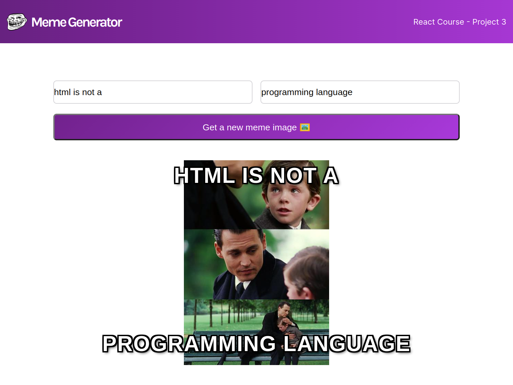

# Meme generator

Purpose of making this project was learning of useState, how can I use eventListener in my React Component, also learn about pass state data as props, Conditional rendering, React forms, useEffect, .... 

### Screenshot

### Built with

- HTML
- CSS custom properties
- Flexbox
- JAVASCRIPT
- [React](https://react.dev/) - JS library

### Continued development

I will add this section ....

### Useful resources

- [React](https://react.dev/)

- [YouTube](https://www.youtube.com/) 

- [w3schools](https://www.w3schools.com/) 

## Author

- mr-dargi